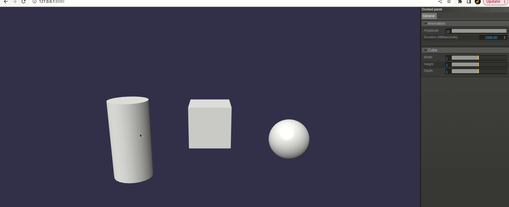

### Install
```npm install```

### Run
* ```npm run dev```
* Go to `localhost:8080` in the web browser

### Environment
The ```index.ts``` script loads a simple Babylon.js scene and adds three primitive objects: Cylinder, Cube, IcoSphere.
Selecting a mesh bring's up the UI in right hand panel window with primitives parameters adjustment. 
When a primitive mesh is selected, the UI display options specific for the selected primitive. It should be possible to set:
* For the *Cube*: 3 dimensions: width, height, depth (range 0.1-2.0)
* For the *Cylinder*: Diameter and height (range 0.1-2.0)
* For the *IcoSphere*: Diameter (range 0.1-2.0) and subdivisions (range 1-10)

On clicking the Geometries the selected mesh get bounce.



